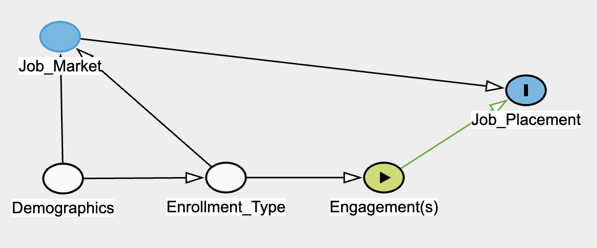
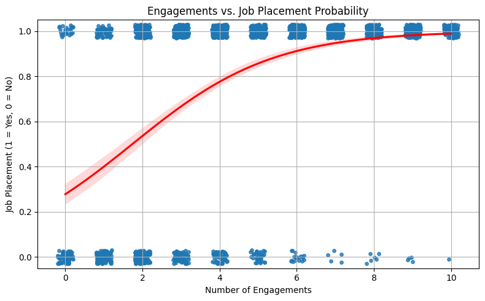
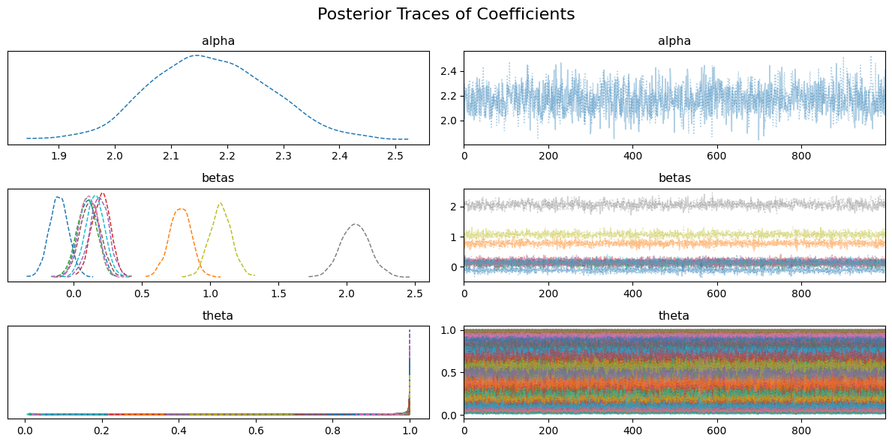

# Causal Inference Project Log

> **Data: the ongoing frontier.**  
> These are the voyages of the starship *Causality*.  
> Its semester-long mission:  
> To explore strange new relationships,  
> To seek out drivers of post-graduation success,  
> And to boldly infer what no student has inferred before.

# Milestone 1: Draft Project Idea

The Dean’s Office of the Jon M. Huntsman School of Business, utlizies
Salesforce to collect recruitment, enrollment, and post-graduation data
on students. I seek to understand how a student’s involvement with
extracurricular activities, particularly corporate partner engagements,
impact workforce placement and starting salary. With this data, I aim to
understand the efficacy of corporate partner engagements as it relates
to successful student outcomes (i.e., job placement and starting salary
post-graduation)

# Milestone 2: Narrate the Data Story

\***Data Context**: The Dean’s Office includes the External Relations
Team, which works with alumni and corporate partners to coordinate
engagements and develop hiring pipelines. The External Relations Team
aims to create opportunities for students to connect with industry
professionals, with the intent to enhance students’ chances for job
placement and higher starting salaries.

\***Data Question**: The External Relations Team wants to understand
whether attending alumni and corporate partner engagements causes better
job placement and higher starting salaries for students. To answer this
question, a causal inference analysis will be utilized to identify if
there’s a cause-and-effect relationship between engagement participation
and positive post-graduation outcomes.

\***Data Sources**: The Dean’s Office collects event registration and
check-in data inconsistently and uses a non-required, one-time survey to
gather job placement and salary data from students after graduation.
Since not all students respond to the survey, LinkedIn is used to verify
if a student has found a job after graduation and if so, Glassdoor is
used to estimate their starting salary based on experience, job title,
and job location.

\***Data Challenges**: The External Relations Team faces several data
challenges in determining whether alumni and corporate partner
engagements truly influence student outcomes. Registration for and
attendance at engagement events isn’t always tracked consistently, which
leaves gaps in understanding how often and how deeply students
participate.

The optional graduation survey can skew results due to response bias,
and, for non-respondents, the use of LinkedIn and Glassdoor introduces
uncertainty since LinkedIn profiles may not be current, and Glassdoor
salary estimates aren’t always precise.

Finally, establishing causation rather than simple correlation requires
collecting and controlling for variables like Demographics,
Enrollment_Type, and Job_Market, ensuring that any observed effect on
job placement or starting salary actually stems from engagement rather
than preexisting differences among students.

\***Data Solutions**: One approach might be to standardize how
attendance is recorded, requiring consistent registration and check-in
to create a more accurate measure of student participation.

Offering small incentives for the graduation survey or making it a
graduation checkpoint could improve response rates and reduce bias. For
students who do not respond, the External Relations Team might consider
documenting a confidence level for any inferred salary data from
LinkedIn or Glassdoor, clarifying that these numbers are estimates.

To address the challenge of proving causation, collecting additional
information—such as Demographic, Enrollment_Type, and Job_Market
data—would allow for stronger statistical methods, such as causal
estimation and a matching strategy, that control for confounding
variables among students.

\***Data Impact**: If the analysis shows that engagement events
positively influence students’ job prospects and salaries, the External
Relations Team may decide to prioritize these activities more and
develop student-facing messaging highlighting the positive impacts of
participation.

However, if no significant relationship is found, the External Relations
Team could adjust overall strategy and shift focus to other efforts that
have a more significant impact on student outcomes.

\***Data Presentation**: To ensure the findings are both accessible and
actionable, an interactive dashboard could be developed that showcases
key metrics, such as event attendance trends, job placement rates, and
salary distributions.

Simplifying technical analyses—like propensity score matching—into clear
visuals or brief summaries would help non-technical stakeholders
understand how engagement impacts student outcomes.

Sharing statistical findings in student-facing messaging could further
underscore the real-world benefits of attending events, while concise
executive summaries would enable leadership to quickly grasp the main
conclusions and decide on resource allocation.

# Milestone 3: Specify a DAG

# Milestone 4: Specify an Identification Strategy

**Causal Effect Identifcation**

\***Adjustment**: Total Effect

\***Exposure**: Engagement(s)

\***Outcome**: Job_Placement

\***Adjusted**: Demographics & Enrollment_Type

Correctly adjusted ✔️

\***Minimal sufficient adjustment sets containing Demographics,
Enrollment_Type for estimating the total effect of Engagement(s) on
Job_Placement**: Demographics, Enrollment_Type

**Testable Implications**

The model implies the following conditional independences:

\*Demographics ⊥ Engagement(s) \| Enrollment_Type

\*Demographics ⊥ Job_Placement \| Engagement(s), Job_Market

\*Demographics ⊥ Job_Placement \| Enrollment_Type, Job_Market

\*Enrollment_Type ⊥ Job_Placement \| Engagement(s), Job_Market

\*Engagement(s) ⊥ Job_Market \| Enrollment_Type

**Summary**

\***Exposure**: Engagement(s)

\***Outcome**: Job_Placement

\***Covariates**: 3

\***Causal Paths**: 1

# Milestone 5: Simulate Data & Recover Parameters

[View Code](../code/simulating_data.py.py)

# Milestone 6: Conduct Exploratory Data Analysis

**Assumptions & Research**

\***Race_White**: Majority (85%)

\***Age**: 21 to 27

\***Gender_Male**: Majority (60%)

\***Undergraduate**: Majority (75%)

\***Full-Time**: Majority (75%)

\***Program_Label**: 10-Program Split

\***GPA**: 3.50 Average

\***Engagements**: 1 to 10

\***Internships**: 1 to 3

\***Industry_Label**: 11-Industry Split

\***From_Utah**: Majority (60%)

# Milestone 7: Estimate Causal Effects

[View Code](../code/causal_effects_estimate.py)

\***Mean**: 1.08

\***95% HDI (Credible Interval)**: \[0.93, 1.23\]

\***Interpretation**: Holding all other variables constant, each
additional engagement increases the log-odds of job placement by
approximately 1.08

# Milestone 8: Intermediate Presentation Slides

[View Slides](../presentations/intermediate_presentation.qmd)

# Milestone 9: Consider Conjoint Experiment

If an incentive was being considered for implementation, using conjoint
could help to develop program parameters that actually promote behavior
based on user interests.

# Milestone 10: Consider Diff-in-Diff Strategy

While there have not been any official policy changes at the
college-level reflected in my dataset (i.e., incentive program for
students engaging in programming), something I would be interested in
exploring is using a Diff-in-Diff strategy with data from the ASC’s
HUSTLE system.

As an extension of my current research, and once the HUSTLE system is
fleshed out with time series data before and after public
incentivization, I could run an analysis that may provide insight
regarding the efficacy of incentivized programs as is relates to student
engagement.

Furthermore, if my overall findings conclude that there is a causal
relationship between Engagement and Job_Placement and/or
Starting_Salary, using the ASC’s HUSTLE system as a case study for how
engagement behavior is impacted through incentivization, as a college,
we could implement a similar program. Of course, the goal here would be
to encourage students to engage so that their success after graduation
is more likely (i.e., Job_Placement and/or Starting_Salary)

# Milestone 11: Clean Up Project Log

**Project Setup**

\***Code**: simulating_data.py, causal_effects_estimate.py, and
matching_strategy.py

\***Data**: simulated_data.py

\***Figures**: See folder

\***Presentations**: intermediate_presentation.qmd and
final_presentation.qmd

\***Writing**: Project_Log.qmd

# Milestone 12: Consider Matching Strategy

The matching strategy would be relevant in this context to isolate the
causal effect of student engagement on job placement by comparing
students with similar backgrounds but different engagement levels,
mimicking a randomized experiment

[View Code](../code/matching_strategy.py)

**Estimated Causal Effect**: 0.316 (High - Low Engagement)

**Interpretation**: On average, individuals with high engagement were
31.6 percentage points more likely to be placed in a job than matched
individuals with low engagement

# Milestone 13: Consider Regression Discontinuity & Marginal Effects

There are currently no cutoffs in place (i.e., If a student attends five
events, they get access to extra career prep support). However, if there
was, this would be a type of analysis that could be used to measure the
effect

Where the outcome variable is binary (Job_Placement 1 = Yes, 0 = No),
logistic regression is being used and thus, marginal effects would be
helpful in interpreting results

# Milestone 14: Final Presentation Slides

[View Slides](../presentations/final_presentation.qmd)
